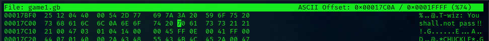
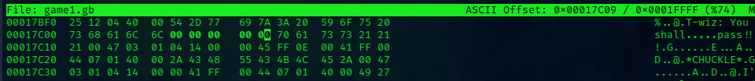
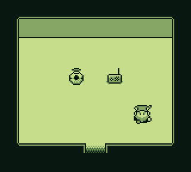
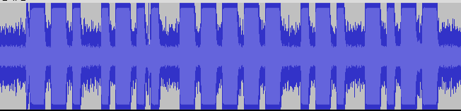

# Game Cartridges: Vol 2

**Difficulty**: :fontawesome-solid-star::fontawesome-solid-star::fontawesome-solid-star::fontawesome-regular-star::fontawesome-regular-star: 
**Direct link**: [ROM](https://gamegosling.com/vol2-akHB27gg6pN0/rom/game0.gb)
**Direct link**: [ROM](https://gamegosling.com/vol2-akHB27gg6pN0/rom/game1.gb)

## Objective

!!! question "Request"
    Find the second Gamegosling cartridge and beat the game

## Hints

??? tip "Gameboy 2"
    Try poking around Pixel Island. There really aren't many places you can go here, so try stepping everywhere and see what you get!

??? tip "Gameboy 2"
    1) This feels the same, but different! 2) If it feels like you are going crazy, you probably are! Or maybe, just maybe, you've not yet figured out where the hidden ROM is hiding. 3) I think I may need to get a DIFFerent perspective. 4) I wonder if someone can give me a few pointers to swap.

## Solution

I solved this by editing the binary so that the wizard text 'you shall pass' instead of 'you shall not pass'. You must change the hex value to 00 for each of the values "not" and the spaces. Once you go past the wizard you will encounter a radio that is producing a morse code signal. I had trouble hearing the code so I did an audio recording of it using Audacity. The wave forms clearly showed the dashes and dots that make up the code. Using online resouces you can translate the morse. The code is "gl0ry".

### Images

!!! success "Answer"
    gl0ry 
    
## Response

!!! quote "Insert Elf Name"
    Copy the final part of the conversation with Elf Name here.
