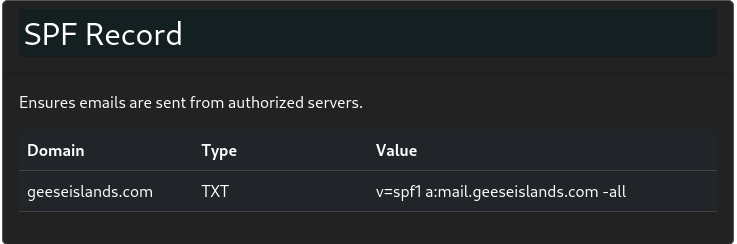
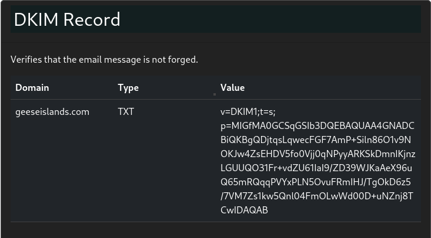
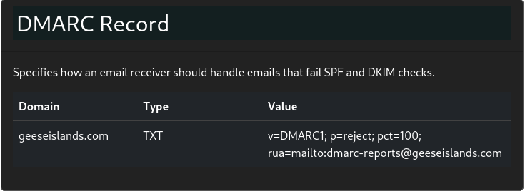

# Phish Detection Agency (submitted after deadline)

**Difficulty**: :fontawesome-solid-star::fontawesome-solid-star::fontawesome-regular-star::fontawesome-regular-star::fontawesome-regular-star:<br/>
**Direct link**: [Phishing Detection Agency](https://hhc23-phishdetect-dot-holidayhack2023.ue.r.appspot.com/)

## Objective

!!! question "Request"
    Fitzy Shortstack on Film Noir Island needs help battling dastardly phishers. Help sort the good from the bad!

??? quote "Fitzy Shortstack"
    Just my luck, I thought...

A cybersecurity incident right in the middle of this stakeout.

Seems we have a flood of unusual emails coming in through ChatNPT.

Got a nagging suspicion it isn't catching all the fishy ones.

You're our phishing specialist right? Could use your expertise in looking through the output of ChatNPT.

Not suggesting a full-blown forensic analysis, just mark the ones screaming digital fraud.

We're looking at all this raw data, but sometimes, it takes a keen human eye to separate the chaff, doesn't it?

I need to get more powdered sugar for my donuts, so do ping me when you have something concrete on this.

## Hints

??? tip "DMARC, DKIM, and SPF, oh my!"
    Discover the essentials of email security with DMARC, DKIM, and SPF at Cloudflare's Guide.

### Images







## Solution

 I used Firefox Web Developer tools to find that the contents of all the emails are provided in a file 'seed.js'. https://hhc23-phishdetect-dot-holidayhack2023.ue.r.appspot.com/static/seed.js. I then wrote a Python script to extract the contents we are interested in (see code below) from this file. With this organized and consise data I was able to determine which of the emails are phishing attempts.
 
 Email:
 	1 Safe
 	2 Phish 
 	3 Safe
 	4 Safe
 	5 Safe
 	6 Safe
 	7 Safe
 	8 Phish 
 	9 Safe
 	10 Safe
 	11 Safe
 	12 Safe
 	13 Safe
 	14 Safe
 	15 Phish
 	16 Safe
 	17 Phish
 	18 Safe
 	19 Phish
 	20 Safe
 	21 Phish
 	22 Safe
 	23 Phish
 	24 Phish
 	25 Safe
 	26 Safe
 	27 Safe
 	28 Phish  
 	29 Safe
 	30 Safe
 	31 Safe
 	32 Phish
 	33 Safe
 	34 Safe


### Python script to organize email data from seed.js
```
import re
import requests

# get the file that has all the email data
seed = requests.get("https://hhc23-phishdetect-dot-holidayhack2023.ue.r.appspot.com/static/seed.js").text

for l in seed:
    m = re.search(r"(from:.+)", l)  # From field
    if(m):
        sf = m.group(1).replace("\"",'')
        print(sf.replace(",",'\t'), end='')

    m = re.search(r"(to:.+)", l)   # To field
    if(m):
        sf = m.group(1).replace("\"",'')
        print(sf.replace(",",'\t'))

    m = re.search(r"headers:(.+)", l)   # Headers field
    if(m):
        sf = m.group(1).replace("\"",'')
        sf = sf.replace(";\\n", "\n")
        sf = sf.replace("\\n", "\n")
        sf = sf.replace(";", "\n")
        print(sf.replace(",",''))

    m = re.search(r"(subject:.+)", l)  # Subject field
    if(m):
        sf = m.group(1).replace("\"",'')
        print(sf.replace(",",''))

    m = re.search(r"(date:.+)", l)   # Date field
    if(m):
        sf = m.group(1).replace("\"",'')
        print(sf.replace(",",''))

    m = re.search(r"(status:.+)", l)   # Status field
    if(m):
        sf = m.group(1).replace("\"",'')
        sf = sf.replace("0", "Safe")
        sf = sf.replace("1", "Phish")
        print(sf.replace(",",''))
        print()
```

### Email data
```
from: david.jones@geeseislands.com      to: admin.tech@geeseislands.com
 Return-Path: <david.jones@geeseislands.com>
Received: from mail.geeseislands.com
DKIM-Signature: v=1
 a=rsa-sha256
 d=geeseislands.com
 s=default
 b=HJgZP0lGJb8xK3t18YsOUpZ+YvgcCj2h3ZdCQF/TN0XQlWgZt4Ll3cEjy1O4Ed9BwFkN8XfOaKJbnN+lCzA8DyQ9PDPkT9PeZw2+JhQK1RmZdJlfg8aIlXvB2Jy2b2RQlKcY0a5+j/48edL9XkF2R8jTtKgZd9JbOOyD4EHD6uLX5
DMARC: Pass
subject: Tech Team's Holiday Hackathon
date: 2023-09-10 08:20:00
status: Safe

from: victor.davis@geeseislands.com     to: admin.research@geeseislands.com
 Return-Path: <victor.davis@anotherdomain.com>
Received: from anotherdomain.com
DKIM-Signature: v=1
 a=rsa-sha256
 d=anotherdomain.com
 s=default
 b=HJgZP0lGJb8xK3t18YsOUpZ+YvgcCj2h3ZdCQF/TN0XQlWgZt4Ll3cEjy1O4Ed9BwFkN8XfOaKJbnN+lCzA8DyQ9PDPkT9PeZw2+JhQK1RmZdJlfg8aIlXvB2Jy2b2RQlKcY0a5+j/48edL9XkF2R8jTtKgZd9JbOOyD4EHD6uLX5
DMARC: Fail
subject: Invitation to Research Grant Meeting
date: 2023-08-15 11:30:00
status: Phish

from: laura.moore@geeseislands.com      to: admin.research@geeseislands.com
 Return-Path: <laura.moore@geeseislands.com>
Received: from mail.geeseislands.com
DKIM-Signature: v=1
 a=rsa-sha256
 d=geeseislands.com
 s=default
 b=HJgZP0lGJb8xK3t18YsOUpZ+YvgcCj2h3ZdCQF/TN0XQlWgZt4Ll3cEjy1O4Ed9BwFkN8XfOaKJbnN+lCzA8DyQ9PDPkT9PeZw2+JhQK1RmZdJlfg8aIlXvB2Jy2b2RQlKcY0a5+j/48edL9XkF2R8jTtKgZd9JbOOyD4EHD6uLX5
DMARC: Pass
subject: Coral Reef Study Findings
date: 2023-07-18 09:20:00
status: Phish

from: quentin.adams@geeseislands.com    to: admin.quality@geeseislands.com
 Return-Path: <quentin.adams@geeseislands.com>
Received: from mail.geeseislands.com
DKIM-Signature: v=1
 a=rsa-sha256
 d=geeseislands.com
 s=default
 b=HJgZP0lGJb8xK3t18YsOUpZ+YvgcCj2h3ZdCQF/TN0XQlWgZt4Ll3cEjy1O4Ed9BwFkN8XfOaKJbnN+lCzA8DyQ9PDPkT9PeZw2+JhQK1RmZdJlfg8aIlXvB2Jy2b2RQlKcY0a5+j/48edL9XkF2R8jTtKgZd9JbOOyD4EHD6uLX5
DMARC: Pass
subject: Quality Assurance Protocols Meeting
date: 2023-09-05 12:30:00
status: Phish

from: michael.taylor@geeseislands.com   to: admin.project@geeseislands.com
 Return-Path: <michael.taylor@geeseislands.com>
Received: from mail.geeseislands.com
DKIM-Signature: v=1
 a=rsa-sha256
 d=geeseislands.com
 s=default
 b=HJgZP0lGJb8xK3t18YsOUpZ+YvgcCj2h3ZdCQF/TN0XQlWgZt4Ll3cEjy1O4Ed9BwFkN8XfOaKJbnN+lCzA8DyQ9PDPkT9PeZw2+JhQK1RmZdJlfg8aIlXvB2Jy2b2RQlKcY0a5+j/48edL9XkF2R8jTtKgZd9JbOOyD4EHD6uLX5
DMARC: Pass
subject: Project Management Best Practices
date: 2023-07-22 14:10:00
status: Safe

from: rachel.baker@geeseislands.com     to: admin.production@geeseislands.com
 Return-Path: <rachel.baker@geeseislands.com>
Received: from mail.geeseislands.com
DKIM-Signature: v=1
 a=rsa-sha256
 d=geeseislands.com
 s=default
 b=HJgZP0lGJb8xK3t18YsOUpZ+YvgcCj2h3ZdCQF/TN0XQlWgZt4Ll3cEjy1O4Ed9BwFkN8XfOaKJbnN+lCzA8DyQ9PDPkT9PeZw2+JhQK1RmZdJlfg8aIlXvB2Jy2b2RQlKcY0a5+j/48edL9XkF2R8jTtKgZd9JbOOyD4EHD6uLX5
DMARC: Pass
subject: Production Milestones Meeting
date: 2023-09-17 13:55:00
status: Safe

from: yvonne.jackson@geeseislands.com   to: admin.clientrelations@geeseislands.com
 Return-Path: <yvonne.jackson@geeseislands.com>
Received: from mail.geeseislands.com
DKIM-Signature: v=1
 a=rsa-sha256
 d=geeseislands.com
 s=default
 b=HJgZP0lGJb8xK3t18YsOUpZ+YvgcCj2h3ZdCQF/TN0XQlWgZt4Ll3cEjy1O4Ed9BwFkN8XfOaKJbnN+lCzA8DyQ9PDPkT9PeZw2+JhQK1RmZdJlfg8aIlXvB2Jy2b2RQlKcY0a5+j/48edL9XkF2R8jTtKgZd9JbOOyD4EHD6uLX5
DMARC: Pass
subject: Enhancing Client Relationships Workshop
date: 2023-11-28 14:20:00
status: Safe

from: xavier.jones@geeseislands.com     to: admin.itsecurity@geeseislands.com
 Return-Path: <xavier.jones@unauthorizedsource.com>
Received: from unauthorizedsource.com
DKIM-Signature: Invalid
DMARC: Fail
subject: Urgent IT Security Update
date: 2023-08-02 10:45:00
status: Safe

from: jason.brown@geeseislands.com      to: admin.sales@geeseislands.com
 Return-Path: <jason.brown@geeseislands.com>
Received: from mail.geeseislands.com
DKIM-Signature: v=1
 a=rsa-sha256
 d=geeseislands.com
 s=default
 b=HJgZP0lGJb8xK3t18YsOUpZ+YvgcCj2h3ZdCQF/TN0XQlWgZt4Ll3cEjy1O4Ed9BwFkN8XfOaKJbnN+lCzA8DyQ9PDPkT9PeZw2+JhQK1RmZdJlfg8aIlXvB2Jy2b2RQlKcY0a5+j/48edL9XkF2R8jTtKgZd9JbOOyD4EHD6uLX5
DMARC: Pass
subject: Boosting End of Year Sales
date: 2023-10-21 10:05:00
status: Safe

from: wendy.mitchell@geeseislands.com   to: admin.marketing@geeseislands.com
 Return-Path: <wendy.mitchell@geeseislands.com>
Received: from mail.geeseislands.com
DKIM-Signature: v=1
 a=rsa-sha256
 d=geeseislands.com
 s=default
 b=HJgZP0lGJb8xK3t18YsOUpZ+YvgcCj2h3ZdCQF/TN0XQlWgZt4Ll3cEjy1O4Ed9BwFkN8XfOaKJbnN+lCzA8DyQ9PDPkT9PeZw2+JhQK1RmZdJlfg8aIlXvB2Jy2b2RQlKcY0a5+j/48edL9XkF2R8jTtKgZd9JbOOyD4EHD6uLX5
DMARC: Pass
subject: Holiday Marketing Brainstorm
date: 2023-11-15 10:50:00
status: Safe

from: steven.clark@geeseislands.com     to: admin.humanresources@geeseislands.com
 Return-Path: <steven.clark@geeseislands.com>
Received: from mail.geeseislands.com
DKIM-Signature: v=1
 a=rsa-sha256
 d=geeseislands.com
 s=default
 b=HJgZP0lGJb8xK3t18YsOUpZ+YvgcCj2h3ZdCQF/TN0XQlWgZt4Ll3cEjy1O4Ed9BwFkN8XfOaKJbnN+lCzA8DyQ9PDPkT9PeZw2+JhQK1RmZdJlfg8aIlXvB2Jy2b2RQlKcY0a5+j/48edL9XkF2R8jTtKgZd9JbOOyD4EHD6uLX5
DMARC: Pass
subject: Employee Wellbeing Workshop
date: 2023-10-01 17:20:00
status: Safe

from: harry.potter@geeseislands.com     to: admin.operations@geeseislands.com
 Return-Path: <harry.potter@geeseislands.com>
Received: from mail.geeseislands.com
DKIM-Signature: v=1
 a=rsa-sha256
 d=geeseislands.com
 s=default
 b=HJgZP0lGJb8xK3t18YsOUpZ+YvgcCj2h3ZdCQF/TN0XQlWgZt4Ll3cEjy1O4Ed9BwFkN8XfOaKJbnN+lCzA8DyQ9PDPkT9PeZw2+JhQK1RmZdJlfg8aIlXvB2Jy2b2RQlKcY0a5+j/48edL9XkF2R8jTtKgZd9JbOOyD4EHD6uLX5
DMARC: Pass
subject: Q4 Operational Excellence
date: 2023-08-17 11:00:00
status: Safe

from: john.doe@geeseislands.com to: admin.support@geeseislands.com
 Return-Path: <john.doe@geeseislands.com>
Received: from mail.geeseislands.com
DKIM-Signature: v=1
 a=rsa-sha256
 d=geeseislands.com
 s=default
 b=HJgZP0lGJb8xK3t18YsOUpZ+YvgcCj2h3ZdCQF/TN0XQlWgZt4Ll3cEjy1O4Ed9BwFkN8XfOaKJbnN+lCzA8DyQ9PDPkT9PeZw2+JhQK1RmZdJlfg8aIlXvB2Jy2b2RQlKcY0a5+j/48edL9XkF2R8jTtKgZd9JbOOyD4EHD6uLX5
DMARC: Pass
subject: Pacific Festive Celebrations Overview
date: 2023-07-15 10:30:00
status: Phish

from: uma.foster@geeseislands.com       to: admin.operations@geeseislands.com
 Return-Path: <uma.foster@geeseislands.com>
Received: from mail.geeseislands.com
DKIM-Signature: v=1
 a=rsa-sha256
 d=geeseislands.com
 s=default
 b=HJgZP0lGJb8xK3t18YsOUpZ+YvgcCj2h3ZdCQF/TN0XQlWgZt4Ll3cEjy1O4Ed9BwFkN8XfOaKJbnN+lCzA8DyQ9PDPkT9PeZw2+JhQK1RmZdJlfg8aIlXvB2Jy2b2RQlKcY0a5+j/48edL9XkF2R8jTtKgZd9JbOOyD4EHD6uLX5
DMARC: Pass
subject: Operational Efficiency Review
date: 2023-10-25 15:05:00
status: Phish

from: steven.gray@geeseislands.com      to: admin.procurement@geeseislands.com
 Return-Path: <steven.gray@geeseislands.com>
Received: from mail.geeseislands.com
DKIM-Signature: Altered Signature
DMARC: Fail
subject: Procurement Process Improvements
date: 2023-09-05 14:50:00
status: Phish

from: patricia.johnson@geeseislands.com to: admin.communications@geeseislands.com
 Return-Path: <patricia.johnson@geeseislands.com>
Received: from mail.geeseislands.com
DKIM-Signature: v=1
 a=rsa-sha256
 d=geeseislands.com
 s=default
 b=HJgZP0lGJb8xK3t18YsOUpZ+YvgcCj2h3ZdCQF/TN0XQlWgZt4Ll3cEjy1O4Ed9BwFkN8XfOaKJbnN+lCzA8DyQ9PDPkT9PeZw2+JhQK1RmZdJlfg8aIlXvB2Jy2b2RQlKcY0a5+j/48edL9XkF2R8jTtKgZd9JbOOyD4EHD6uLX5
DMARC: Pass
subject: Communication Skills Workshop
date: 2023-08-29 10:40:00
status: Safe

from: laura.green@geeseislands.com      to: admin.security@geeseislands.com
 Return-Path: <laura.green@unauthorized.com>
Received: from unauthorized.com
DKIM-Signature: v=1
 a=rsa-sha256
 d=unauthorized.com
 s=default
 b=HJgZP0lGJb8xK3t18YsOUpZ+YvgcCj2h3ZdCQF/TN0XQlWgZt4Ll3cEjy1O4Ed9BwFkN8XfOaKJbnN+lCzA8DyQ9PDPkT9PeZw2+JhQK1RmZdJlfg8aIlXvB2Jy2b2RQlKcY0a5+j/48edL9XkF2R8jTtKgZd9JbOOyD4EHD6uLX5
DMARC: Pass
subject: Security Protocol Briefing
date: 2023-07-20 09:15:00
status: Phish

from: grace.lee@geeseislands.com        to: admin.marketing@geeseislands.com
 Return-Path: <grace.lee@geeseislands.com>
Received: from mail.geeseislands.com
DKIM-Signature: v=1
 a=rsa-sha256
 d=geeseislands.com
 s=default
 b=HJgZP0lGJb8xK3t18YsOUpZ+YvgcCj2h3ZdCQF/TN0XQlWgZt4Ll3cEjy1O4Ed9BwFkN8XfOaKJbnN+lCzA8DyQ9PDPkT9PeZw2+JhQK1RmZdJlfg8aIlXvB2Jy2b2RQlKcY0a5+j/48edL9XkF2R8jTtKgZd9JbOOyD4EHD6uLX5
DMARC: Pass
subject: Marketing for the Holiday Season
date: 2023-11-12 14:30:00
status: Safe

from: nancy@geeseislands.com    to: admin.publicrelations@geeseislands.com
 Return-Path: <nancy@unknownsource.com>
Received: from unknownsource.com
DKIM-Signature: v=1
 a=rsa-sha256
 d=unknownsource.com
 s=default
 b=HJgZP0lGJb8xK3t18YsOUpZ+YvgcCj2h3ZdCQF/TN0XQlWgZt4Ll3cEjy1O4Ed9BwFkN8XfOaKJbnN+lCzA8DyQ9PDPkT9PeZw2+JhQK1RmZdJlfg8aIlXvB2Jy2b2RQlKcY0a5+j/48edL9XkF2R8jTtKgZd9JbOOyD4EHD6uLX5
DMARC: Pass
subject: Public Relations Strategy Meet
date: 2023-09-30 11:45:00
status: Phish

from: victor.harris@geeseislands.com    to: admin.it@geeseislands.com
 Return-Path: <victor.harris@geeseislands.com>
Received: from mail.geeseislands.com
DKIM-Signature: v=1
 a=rsa-sha256
 d=geeseislands.com
 s=default
 b=HJgZP0lGJb8xK3t18YsOUpZ+YvgcCj2h3ZdCQF/TN0XQlWgZt4Ll3cEjy1O4Ed9BwFkN8XfOaKJbnN+lCzA8DyQ9PDPkT9PeZw2+JhQK1RmZdJlfg8aIlXvB2Jy2b2RQlKcY0a5+j/48edL9XkF2R8jTtKgZd9JbOOyD4EHD6uLX5
DMARC: Pass
subject: IT Security Update
date: 2023-11-08 09:30:00
status: Safe

from: rachel.brown@geeseislands.com     to: admin.customerrelations@geeseislands.com
 Return-Path: <rachel.brown@geeseislands.com>
Received: from mail.geeseislands.com
DKIM-Signature: Missing
DMARC: Fail
subject: Customer Feedback Analysis Meeting
date: 2023-08-18 13:35:00
status: Safe

from: karen.evans@geeseislands.com      to: admin.it@geeseislands.com
 Return-Path: <karen.evans@geeseislands.com>
Received: from mail.geeseislands.com
DKIM-Signature: v=1
 a=rsa-sha256
 d=geeseislands.com
 s=default
 b=HJgZP0lGJb8xK3t18YsOUpZ+YvgcCj2h3ZdCQF/TN0XQlWgZt4Ll3cEjy1O4Ed9BwFkN8XfOaKJbnN+lCzA8DyQ9PDPkT9PeZw2+JhQK1RmZdJlfg8aIlXvB2Jy2b2RQlKcY0a5+j/48edL9XkF2R8jTtKgZd9JbOOyD4EHD6uLX5
DMARC: Pass
subject: IT Infrastructure Upgrade Discussion
date: 2023-11-05 13:45:00
status: Safe

from: ursula.morris@geeseislands.com    to: admin.legal@geeseislands.com
 Return-Path: <ursula.morris@differentdomain.com>
Received: from differentdomain.com
DKIM-Signature: v=1
 a=rsa-sha256
 d=differentdomain.com
 s=default
 b=HJgZP0lGJb8xK3t18YsOUpZ+YvgcCj2h3ZdCQF/TN0XQlWgZt4Ll3cEjy1O4Ed9BwFkN8XfOaKJbnN+lCzA8DyQ9PDPkT9PeZw2+JhQK1RmZdJlfg8aIlXvB2Jy2b2RQlKcY0a5+j/48edL9XkF2R8jTtKgZd9JbOOyD4EHD6uLX5
DMARC: Fail
subject: Legal Team Expansion Strategy
date: 2023-07-30 12:00:00
status: Safe

from: quincy.adams@geeseislands.com     to: admin.networking@geeseislands.com
 Return-Path: <quincy.adams@geeseislands.com>
Received: from mail.geeseislands.com
DKIM-Signature: Invalid Signature
DMARC: Fail
subject: Networking Event Success Strategies
date: 2023-07-25 10:10:00
status: Phish

from: isabella.martin@geeseislands.com  to: admin.legal@geeseislands.com
 Return-Path: <isabella.martin@geeseislands.com>
Received: from mail.geeseislands.com
DKIM-Signature: v=1
 a=rsa-sha256
 d=geeseislands.com
 s=default
 b=HJgZP0lGJb8xK3t18YsOUpZ+YvgcCj2h3ZdCQF/TN0XQlWgZt4Ll3cEjy1O4Ed9BwFkN8XfOaKJbnN+lCzA8DyQ9PDPkT9PeZw2+JhQK1RmZdJlfg8aIlXvB2Jy2b2RQlKcY0a5+j/48edL9XkF2R8jTtKgZd9JbOOyD4EHD6uLX5
DMARC: Pass
subject: Environmental Policies Legal Review
date: 2023-09-25 16:40:00
status: Safe

from: oliver.hill@geeseislands.com      to: admin.supply@geeseislands.com
 Return-Path: <oliver.hill@geeseislands.com>
Received: from mail.geeseislands.com
DKIM-Signature: v=1
 a=rsa-sha256
 d=geeseislands.com
 s=default
 b=HJgZP0lGJb8xK3t18YsOUpZ+YvgcCj2h3ZdCQF/TN0XQlWgZt4Ll3cEjy1O4Ed9BwFkN8XfOaKJbnN+lCzA8DyQ9PDPkT9PeZw2+JhQK1RmZdJlfg8aIlXvB2Jy2b2RQlKcY0a5+j/48edL9XkF2R8jTtKgZd9JbOOyD4EHD6uLX5
DMARC: Pass
subject: Supply Chain Optimization Initiatives
date: 2023-08-15 16:50:00
status: Safe

from: nancy.wilson@geeseislands.com     to: admin.client@geeseislands.com
 Return-Path: <nancy.wilson@geeseislands.com>
Received: from mail.geeseislands.com
DKIM-Signature: v=1
 a=rsa-sha256
 d=geeseislands.com
 s=default
 b=HJgZP0lGJb8xK3t18YsOUpZ+YvgcCj2h3ZdCQF/TN0XQlWgZt4Ll3cEjy1O4Ed9BwFkN8XfOaKJbnN+lCzA8DyQ9PDPkT9PeZw2+JhQK1RmZdJlfg8aIlXvB2Jy2b2RQlKcY0a5+j/48edL9XkF2R8jTtKgZd9JbOOyD4EHD6uLX5
DMARC: Pass
subject: Client Engagement Enhancements
date: 2023-08-03 11:15:00
status: Safe

from: michael.roberts@geeseislands.com  to: admin.compliance@geeseislands.com
 Return-Path: <michael.roberts@externalserver.com>
Received: from externalserver.com
DKIM-Signature: v=1
 a=rsa-sha256
 d=externalserver.com
 s=default
 b=HJgZP0lGJb8xK3t18YsOUpZ+YvgcCj2h3ZdCQF/TN0XQlWgZt4Ll3cEjy1O4Ed9BwFkN8XfOaKJbnN+lCzA8DyQ9PDPkT9PeZw2+JhQK1RmZdJlfg8aIlXvB2Jy2b2RQlKcY0a5+j/48edL9XkF2R8jTtKgZd9JbOOyD4EHD6uLX5
DMARC: Pass
subject: Compliance Training Schedule Announcement
date: 2023-08-05 14:20:00
status: Safe

from: alice.smith@geeseislands.com      to: admin.events@geeseislands.com
 Return-Path: <alice.smith@geeseislands.com>
Received: from mail.geeseislands.com
DKIM-Signature: v=1
 a=rsa-sha256
 d=geeseislands.com
 s=default
 b=HJgZP0lGJb8xK3t18YsOUpZ+YvgcCj2h3ZdCQF/TN0XQlWgZt4Ll3cEjy1O4Ed9BwFkN8XfOaKJbnN+lCzA8DyQ9PDPkT9PeZw2+JhQK1RmZdJlfg8aIlXvB2Jy2b2RQlKcY0a5+j/48edL9XkF2R8jTtKgZd9JbOOyD4EHD6uLX5
DMARC: Pass
subject: Summer Beach Cleanup Coordination
date: 2023-08-22 15:45:00
status: Phish

from: frank.harrison@geeseislands.com   to: admin.finance@geeseislands.com
 Return-Path: <frank.harrison@geeseislands.com>
Received: from mail.geeseislands.com
DKIM-Signature: v=1
 a=rsa-sha256
 d=geeseislands.com
 s=default
 b=HJgZP0lGJb8xK3t18YsOUpZ+YvgcCj2h3ZdCQF/TN0XQlWgZt4Ll3cEjy1O4Ed9BwFkN8XfOaKJbnN+lCzA8DyQ9PDPkT9PeZw2+JhQK1RmZdJlfg8aIlXvB2Jy2b2RQlKcY0a5+j/48edL9XkF2R8jTtKgZd9JbOOyD4EHD6uLX5
DMARC: Pass
subject: Annual Budget Review and Forecasting
date: 2023-10-03 09:50:00
status: Phish

from: xavier.edwards@geeseislands.com   to: admin.sales@geeseislands.com
 Return-Path: <xavier.edwards@geeseislands.com>
Received: from mail.geeseislands.com
DKIM-Signature: v=1
 a=rsa-sha256
 d=geeseislands.com
 s=default
 b=HJgZP0lGJb8xK3t18YsOUpZ+YvgcCj2h3ZdCQF/TN0XQlWgZt4Ll3cEjy1O4Ed9BwFkN8XfOaKJbnN+lCzA8DyQ9PDPkT9PeZw2+JhQK1RmZdJlfg8aIlXvB2Jy2b2RQlKcY0a5+j/48edL9XkF2R8jTtKgZd9JbOOyD4EHD6uLX5
DMARC: Pass
subject: Year-End Sales Target Strategies
date: 2023-11-20 11:35:00
status: Phish

from: oliver.thomas@geeseislands.com    to: admin.research@geeseislands.com
 Return-Path: <oliver.thomas@otherdomain.com>
Received: from otherdomain.com
DKIM-Signature: v=1
 a=rsa-sha256
 d=otherdomain.com
 s=default
 b=HJgZP0lGJb8xK3t18YsOUpZ+YvgcCj2h3ZdCQF/TN0XQlWgZt4Ll3cEjy1O4Ed9BwFkN8XfOaKJbnN+lCzA8DyQ9PDPkT9PeZw2+JhQK1RmZdJlfg8aIlXvB2Jy2b2RQlKcY0a5+j/48edL9XkF2R8jTtKgZd9JbOOyD4EHD6uLX5
DMARC: Pass
subject: New Research Project Kickoff
date: 2023-10-17 16:30:00
status: Safe

from: emily.white@geeseislands.com      to: admin.hr@geeseislands.com
 Return-Path: <emily.white@geeseislands.com>
Received: from mail.geeseislands.com
DKIM-Signature: v=1
 a=rsa-sha256
 d=geeseislands.com
 s=default
 b=HJgZP0lGJb8xK3t18YsOUpZ+YvgcCj2h3ZdCQF/TN0XQlWgZt4Ll3cEjy1O4Ed9BwFkN8XfOaKJbnN+lCzA8DyQ9PDPkT9PeZw2+JhQK1RmZdJlfg8aIlXvB2Jy2b2RQlKcY0a5+j/48edL9XkF2R8jTtKgZd9JbOOyD4EHD6uLX5
DMARC: Pass
subject: Island Wildlife Conservation Efforts
date: 2023-07-29 12:15:00
status: Safe

from: teresa.green@geeseislands.com     to: admin.finance@geeseislands.com
 Return-Path: <teresa.green@geeseislands.com>
Received: from mail.geeseislands.com
DKIM-Signature: v=1
 a=rsa-sha256
 d=geeseislands.com
 s=default
 b=HJgZP0lGJb8xK3t18YsOUpZ+YvgcCj2h3ZdCQF/TN0XQlWgZt4Ll3cEjy1O4Ed9BwFkN8XfOaKJbnN+lCzA8DyQ9PDPkT9PeZw2+JhQK1RmZdJlfg8aIlXvB2Jy2b2RQlKcY0a5+j/48edL9XkF2R8jTtKgZd9JbOOyD4EHD6uLX5
DMARC: Pass
subject: Financial Planning for 2024
date: 2023-10-12 08:45:00
status: Phish
```

!!! success "Answer"

Congratulations, Ace Detective! You've successfully navigated the treacherous waters of deception and emerged victorious. Your sharp wits and keen eye for detail have cracked the case wide open, proving that even the most cunning phishing attempts are no match for your discerning mind.

In a world where shadows often obscure the truth, you shone a bright light on duplicity. Your unwavering commitment to truth and justice in the digital realm has kept our virtual streets safe. Thanks to your efforts, the Phishing Detection Agency stands strong, a bulwark against the tide of digital deceit.

Remember, the battle against phishing is ongoing, but with sleuths like you on the case, the internet remains a safer place. You're not just a hero; you're a guardian of the digital frontier. So here's to you, the quintessential cyber sleuth, a beacon of hope in these pixelated alleyways of misinformation.

Your achievement is not just a personal victory; it's a triumph for all of us in the agency.


## Response

!!! quote "Fitzy Shortstack"
    Copy the final part of the conversation with Elf Name here.
