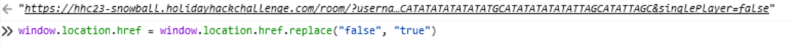
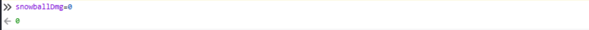

# Snowball Fight

**Difficulty**: :fontawesome-solid-star::fontawesome-solid-star::fontawesome-regular-star::fontawesome-regular-star::fontawesome-regular-star: 
**Direct link**: [Objective 2 website](https://hhc23-snowball.holidayhackchallenge.com)

## Objective

!!! question "Request"
    Visit Christmas Island and talk to Morcel Nougat about this great new game. Team up with another player and show Morcel how to win against Santa! [images](../img/objectives/o2/snowball.PNG)

??? quote "Morcel Nougat"
    Hey there, I'm Morcel Nougat, elf extraordinaire!

You won't believe this, but we're on a magical tropical island called Christmas Island, and it even has snow!

I'm so glad ChatNPT suggested we come here this year!

Santa, some elves, and I are having a snowball fight, and we'd love you to join us. Santa's really good, so trust me when I say it's way more fun when played with other people.

But hey, if you can figure out a way to play solo by tinkering with client side variables or parameters to go solo mode, go for it!

There's also ways to make the elves' snowballs do no damage, and all kinds of other shenanigans, but you didn't hear that from me.

Just remember, it's all about having fun and sharing the joy of the holiday season with each other.

So, are you in? We'd really love your company in this epic snowball battle!

## Hints

??? tip "Snowball Super Hero"
    Its easiest to grab a friend play with and beat Santa but tinkering with client-side variables can grant you all kinds of snowball fight super powers. You could even take on Santa and the elves solo!
    
??? tip "Consoling iFrames"
    Have an iframe in your document? Be sure to select the right context before meddling with JavaScript.

## Solution

The easiest way to solve this challenge was to enable Single Player mode (which brings in a very helpful elf) and to turn snowball damage off. To set single player mode you must set the value singlePlayer=true in the URL, and turn off snowball damage by setting the local variable snowballDmg = 0. Both of these actions are done in the Web Developer Tools which is built into to the Firefox web browser.  

### Images
Set singlePlayer to True  
  

Set snowball damage to zero  

## Response

!!! quote "Morcel Nougat"
    You're like a snowball fighting ninja! A real-life legend. Can I have your autograph!?
