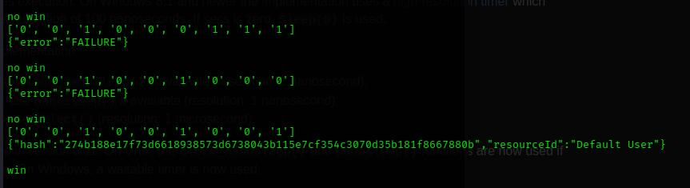

# Reportinator

**Difficulty**: :fontawesome-solid-star::fontawesome-solid-star::fontawesome-regular-star::fontawesome-regular-star::fontawesome-regular-star:<br/>
**Direct link**: [Reportinator terminal]https://hhc23-reportinator-dot-holidayhack2023.ue.r.appspot.com

## Objective

!!! question "Request"
    Noel Boetie used ChatNPT to write a pentest report. Go to Christmas Island and help him clean it up.

??? quote "Noel Boetie"
    Hey there, Noel Boetie speaking! I recently tried using ChatNPT to generate my penetration testing report.

It's a pretty nifty tool, but there are a few issues in the output that I've noticed.

I need some guidance in finding any errors in the way it generated the content, especially those odd hallucinations in the LLM output.

I know it's not perfect, but I'd really appreciate the extra eyes on this one.

Some of the issues might be subtle, so don't be afraid to dig deep and ask for further clarification if you're unsure.

I've heard that you folks are experts about LLM outputs and their common issues, so I trust you can help me with this.

Your input will be invaluable to me, so please feel free to share any insights or findings you may have.

I'm looking forward to working with you all and improving the quality of the ChatNPT-generated penetration testing report.

Thanks in advance for your help! I truly appreciate it! Let's make this report the best it can be!

## Hints

??? tip "Reportinator"
    I know AI sometimes can get specifics wrong unless the prompts are well written. Maybe chatNPT made some mistakes here.

## Solution

 I initially tried to resolve this using AI (specifically MS Copilot); however, all nine of the challenges came back from Copilot as correct. I may have use Copilot incorrectly but it didn't matter. I just wanted to move through this challenge to get to the more interesting ones. So my solution was to load the website in Burpsuite and through Firefox Web Developer Tools to determine the HTTP requests/responses that were required to interact with the game. With this knowledge I created a Python script to iterate through all the permutations of answers to find the correct set of answers. It is shown in the code segment below. 
 
 There are 9 questions which means there are 512 answers to the the challenge. I just brute forced all permutations until a solution was found.
 
 ### Images
Success from Python script<br><br>
<br><br>

### Code blocks

```
import requests
import logging
import time
import re

# uncomment for logging of http traffic
#
#try:
#    from http.client import HTTPConnection
#except ImportError:
#    from httplib import HTTPConnection
#HTTPConnection.debuglevel = 1

#logging.basicConfig()
#logging.getLogger().setLevel(logging.DEBUG)
#requests_log = logging.getLogger("urllib3")
#requests_log.setLevel(logging.DEBUG)
#requests_log.propagate = True

# fake that you are using a brower
useragent = 'Mozilla/5.0 (X11; Linux x86_64; rv:109.0) Gecko/20100101 Firefox/115.0'

# main site url
url = 'https://hhc23-reportinator-dot-holidayhack2023.ue.r.appspot.com'

# address for checking your answer
checkurl = 'https://hhc23-reportinator-dot-holidayhack2023.ue.r.appspot.com/check'

# cookie name returned from the server
cookiename = 'ReportinatorCookieYum'

# custom header settings for the POST command
cheaders = {'User-Agent': 'Mozilla/5.0 (X11; Linux x86_64; rv:109.0) Gecko/20100101 Firefox/115.0','Origin':'https://hhc23-reportinator-dot-holidayhack2023.ue.r.appspot.com', 'Alt-Used': 'https://hhc23-reportinator-dot-holidayhack2023.ue.r.appspot.com', 'TE': 'trailers', 'Sec-Fetch-Dest':'empty', 'Sec-Fetch-Mode':'cors', 'Sec-Fetch-Site': 'same-origin'} 

# answers to provide to the server
payload = {'input-1':'0','input-2':'0','input-3':'0','input-4':'0','input-5':'0','input-6':'0','input-7':'0','input-8':'0','input-9':'0'}

x = requests.get(url) # contact the server and get the session cookie
y = x.cookies[cookiename]  # extract the cookie value
cdict = dict(ReportinatorCookieYum=y)  # custom dictionary to use in the POST command

# --- loop through all enumerations of answers

for vals in range(512):
    time.sleep(0.3)
    sp = [x for x in format(vals, '09b')]
    print(sp)
    payload = {'input-1':sp[0],'input-2':sp[1],'input-3':sp[2],'input-4':sp[3],'input-5':sp[4],'input-6':sp[5],'input-7':sp[6],'input-8':sp[7],'input-9':sp[8]}

    r = requests.post(checkurl, cookies=cdict, data=payload, headers=cheaders)  # send the answers
    print(r.text)  #  print the results
    if re.search('FAIL', r.text):
        print('no win')
    else:
        print('win')
        break

```

## Response

!!! quote "Noel Boetie"
    Great work! You've successfully navigated through the intricate maze of data, distinguishing the authentic findings from the AI hallucinations. Your diligence in validating the penetration test report is commendable.

Your contributions to ensuring the accuracy and integrity of our cybersecurity efforts are invaluable. The shadows of uncertainty have been dispelled, leaving clarity and truth in their wake. The findings you have authenticated will play a crucial role in fortifying our digital defenses.

We appreciate your expertise and keen analytical skills in this crucial task. You are a true asset to the team. Keep up the excellent work! 
