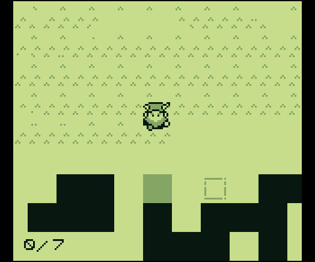
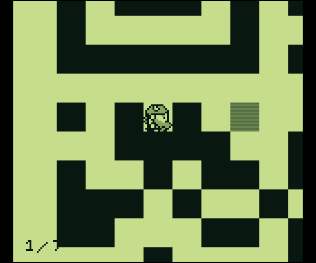
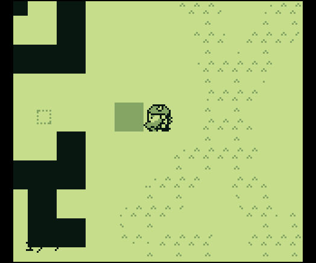
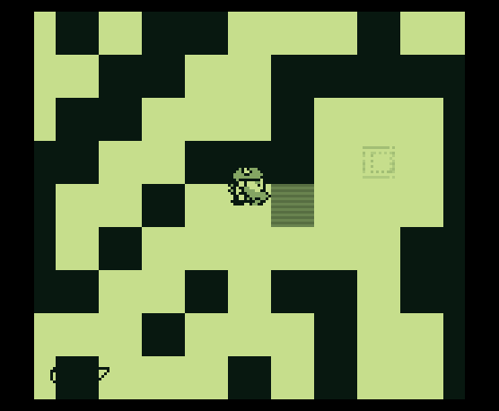
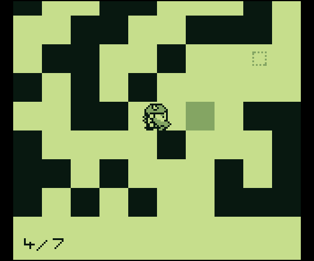
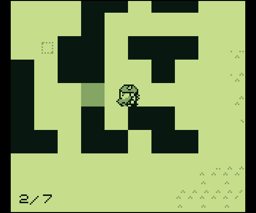
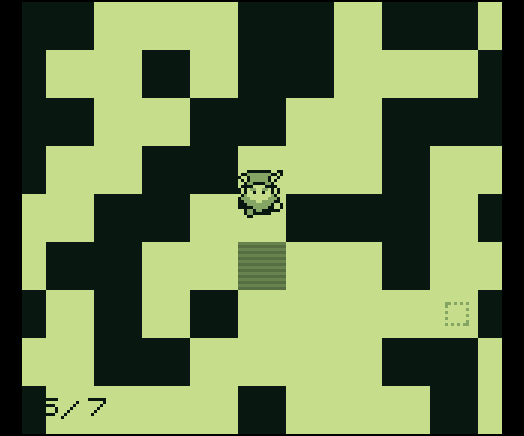
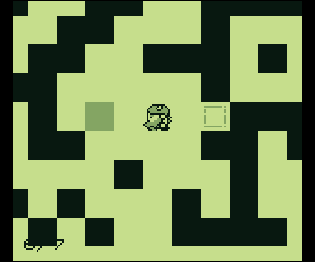

# Game Cartridges: Vol 1

**Difficulty**: :fontawesome-solid-star::fontawesome-regular-star::fontawesome-regular-star::fontawesome-regular-star::fontawesome-regular-star: 
**Direct link**: [ROM](https://gamegosling.com/vol1-uWn1t6xv4VKPZ6FN/rom/game.gb)

## Objective

!!! question "Request"
    Find the first Gamegosling cartridge and beat the game

## Hints

??? tip "Approximate Proximity"
    Listen for the gameboy cartridge detector's proximity sound that activates when near buried treasure. It may be worth checking around the strange toys in the Tarnished Trove.

??? tip "Gameboy 1"
    1) Giving things a little push never hurts. 2) Out of sight but not out of ear-shot 3) You think you fixed the QR code? Did you scan it and see where it leads?

## Solution

Moving the blocks into their correct locations will reveal the QR code that opens a website that displays the text "santaconfusedgivingplanetsqrcode".

### Images

    Order of block movements
    

    Move this block from the far left side
    

    To the far right side 
    

    Next block to move 
    

    Next block to move 

    Next block to move 

    Next block to move 

    Last block to move 

!!! success "Answer"
    santaconfusedgivingplanetsqrcode

